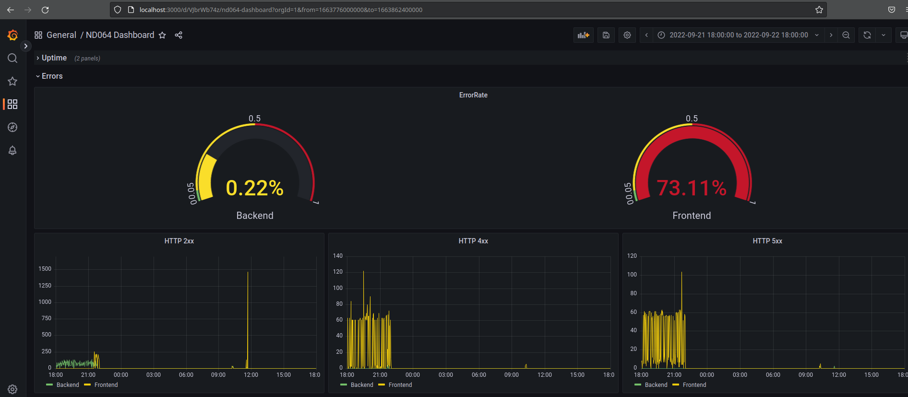

**Note:** For the screenshots, you can store all of your answer images in the `answer-img` directory.

## Verify the monitoring installation

(I had performance issues within the VM and therefore reduced the number of replicas of the reference app from 3 to 1)

## Setup the Jaeger and Prometheus source

## Create a Basic Dashboard

## Describe SLO/SLI
SLO: *monthly uptime* - SLI: 99.5% of all requests in one month are answered successfully

SLO: *request response time* - SLI: 99% of requests have a latency of less than 100ms

## Creating SLI metrics.
1. Availability
    - Percentage of successfully answered requests in a day
2. Errors
    - Number of HTTP 5xx responses per week
3. Average Latency
    - Average response times for requests by the customer in a day
4. Percentage of Slow Responses
    - Percentage of response times slower than a threshold in a day (to see if there are some specific requests that might be optimized)
5. Hardware Limitations
    - Maximum CPU usage in one hour (find out if the hardware reaches its limits)

## Create a Dashboard to measure our SLIs
Create a dashboard to measure the uptime of the frontend and backend services We will also want to measure to measure 40x and 50x errors. Create a dashboard that show these values over a 24 hour period and take a screenshot.

## Tracing our Flask App

## Jaeger in Dashboards

## Report Error
Using the template below, write a trouble ticket for the developers, to explain the errors that you are seeing (400, 500, latency) and to let them know the file that is causing the issue also include a screenshot of the tracer span to demonstrate how we can user a tracer to locate errors easily.

TROUBLE TICKET

Name: Error while accessing /api backend endpoint

Date: September 21 2022, 17:10:33

Subject: HTTP 500 error on /api

Affected Area: `File "/app/app.py", line 64, in my_api`

Severity: High

Description: Accessing the endpoint /app of the backend service sometimes causes an `IndexError`.

## Creating SLIs and SLOs
We want to create an SLO guaranteeing that our application has a 99.95% uptime per month. Name four SLIs that you would use to measure the success of this SLO.

1. Percentage of uptime of the backend and frontend containers is greater than 99.9%
2. Error Rate is less than 0.05% (HTTP4xx and 5xx responses to total number of requests)
3. Average response time less than 150ms
4. Hardware usage does not exceed available resources

## Building KPIs for our plan
Now that we have our SLIs and SLOs, create a list of 2-3 KPIs to accurately measure these metrics as well as a description of why those KPIs were chosen. We will make a dashboard for this, but first write them down here.

1. **Uptime**: Users want to be able to access online services whenever they like. Regular downtime of a service will certainly repell users.
    - At least one frontend pod is up for greater than 99.9% of time
    - At least one backend pod is up for greater than 99.9% of time

2. **Error**: Users want to interact with a fault-free service. The number of errors visible to the user should be as low as possible.
    - Error rate is less than 0.05% (measured in number of HTTP4xx and 5xx as percentage of total responses) measured seperately for front- and backend
    - Number of 4xx and 5xx for front- and backend

3. **Response Time**: The service should be responsive to user interaction.
    - Average reponse time is less than 150ms
    - Percentage of requests that are responded in less than 300ms exeeds 95%

4. **Hardware Usage**: Resource consumption gives an indication if the services need to be scaled vertically with increasing/decreasing number of users. Exeeding available resources may lead to downtime. 
    - Average CPU usage per day should not exceed 80%
    - Average Memory usage per day should not exceed 90%
    - Maximum CPU & Memory usage should not exeed 95% (peak values should never reach 100%)

## Final Dashboard
Create a Dashboard containing graphs that capture all the metrics of your KPIs and adequately representing your SLIs and SLOs. Include a screenshot of the dashboard here, and write a text description of what graphs are represented in the dashboard.  

### Uptime:
- **Container Uptime** displays the percentage in which both the frontend and the backend pods where up and running within the given timeframe. The green threshold is set to 99.9%.
- **Availability** shows if at least one of the pods for both frontend and backend were up and running as timeseries

### Errors:
- **ErrorRate** shows the percentage of HTTP 5xx and 4xx responses within the total number of requests (within the given timespan; green: < 0.05%) divided by frontend and backend
- **HTTP xxx** show the number of HTTP responses as timeseries

### Response Time:
- **Average Response Time** shows the average response time all successful requests (green: < 150ms)
- **Request duration >300ms** shows the percentage of requests slower than 300ms (green: > 95%)
- **Jaeger Backend API Traces** shows jaeger traces to the `/api` entpoint of the backend

### Hardware Usage:
- **CPU & Memory Usage** shows the actual CPU and Memory usage over time
- **Average CPU Usage** shows mean value of CPU usage within the given timeframe (green: < 80%)
- **Max CPU Usage** shows maximum value of CPU usage within the given timeframe (green: < 95%)
- **Average Memory Usage** shows mean value of total Memory usage within the given timeframe (green: < 90%)
- **Max Memory Usage** shows maximum value of Memory usage within the given timeframe (green: < 95%)

